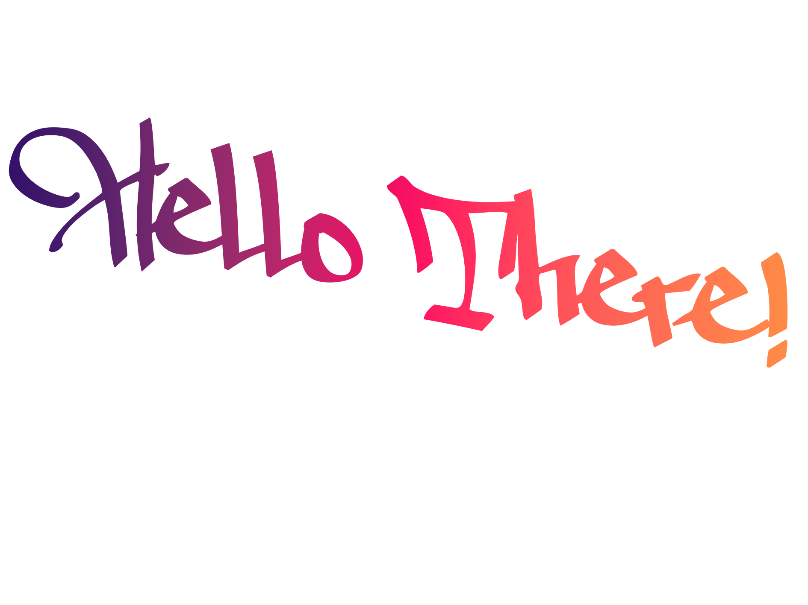

  

 

My favorite hobby is reading random people's GitHub README.

# I don't know how it works.

I use Arch, BTW.

Editor wars veteran.

Never was I spotted in the same room as The Batman.

MATHoholic (Mathing with Typst)

Able to hillucinate without AI.

Fascinated by technology; Too grub brained to understand it.

Gell-Mann Amnesia? that can't be right.

Admires complexity, hates simplicity.

Loves shiny objects; but it's not a syndrome.

Scared of ladies.

# Stats 📊
 

 

  

 

 
# Languages 💻
 

 

  

  

